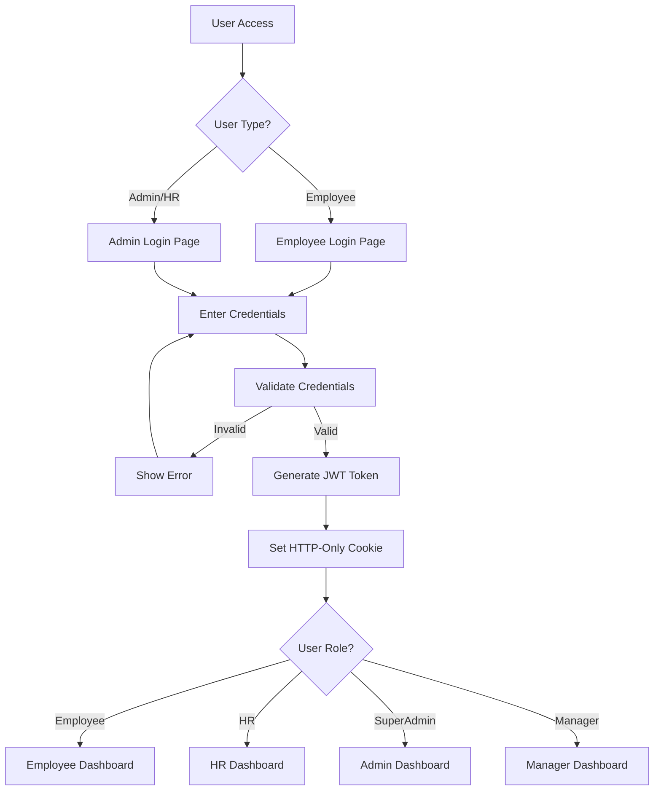
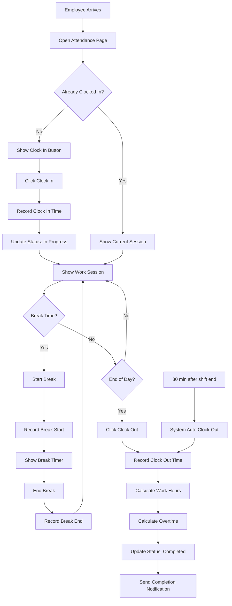
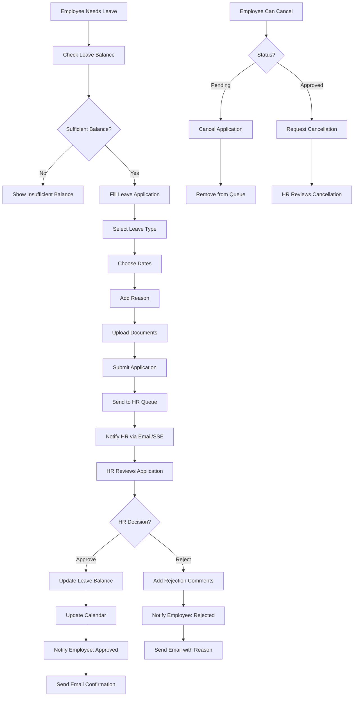
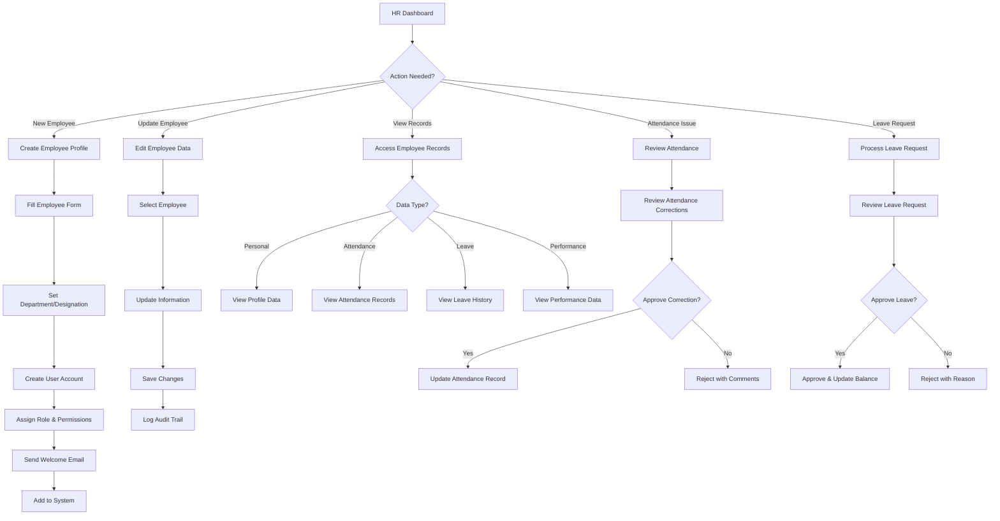
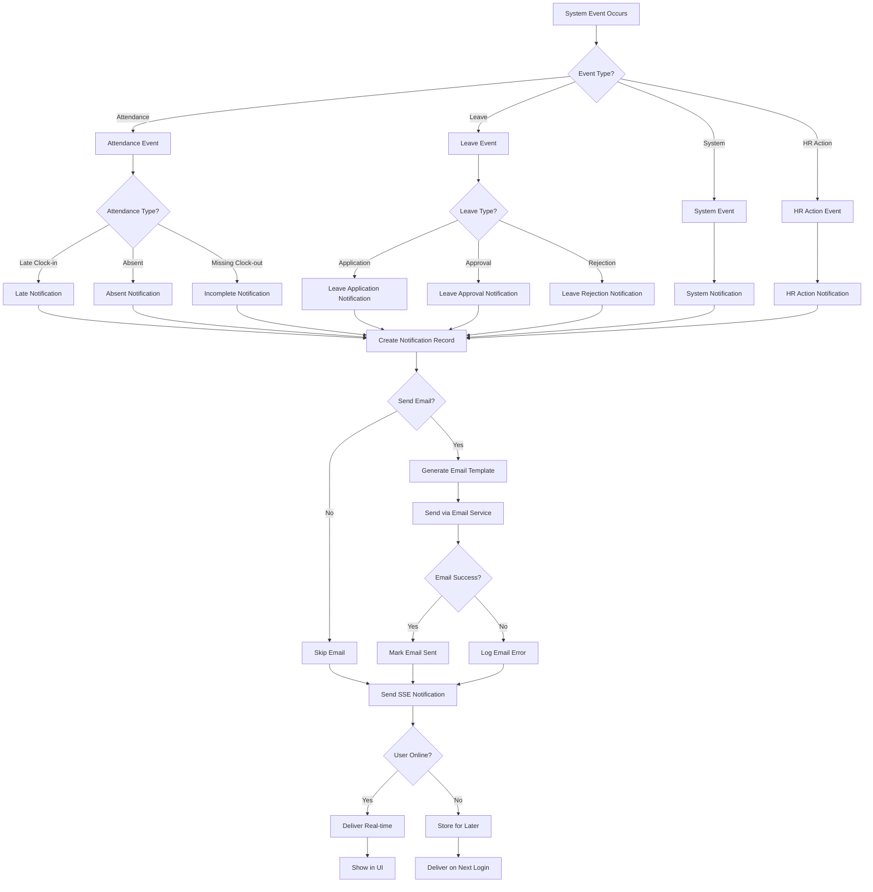
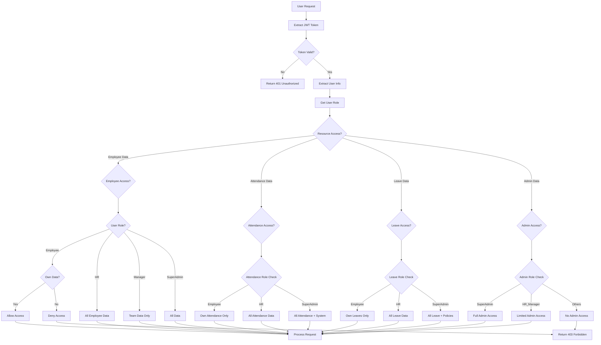
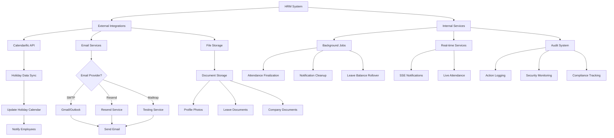
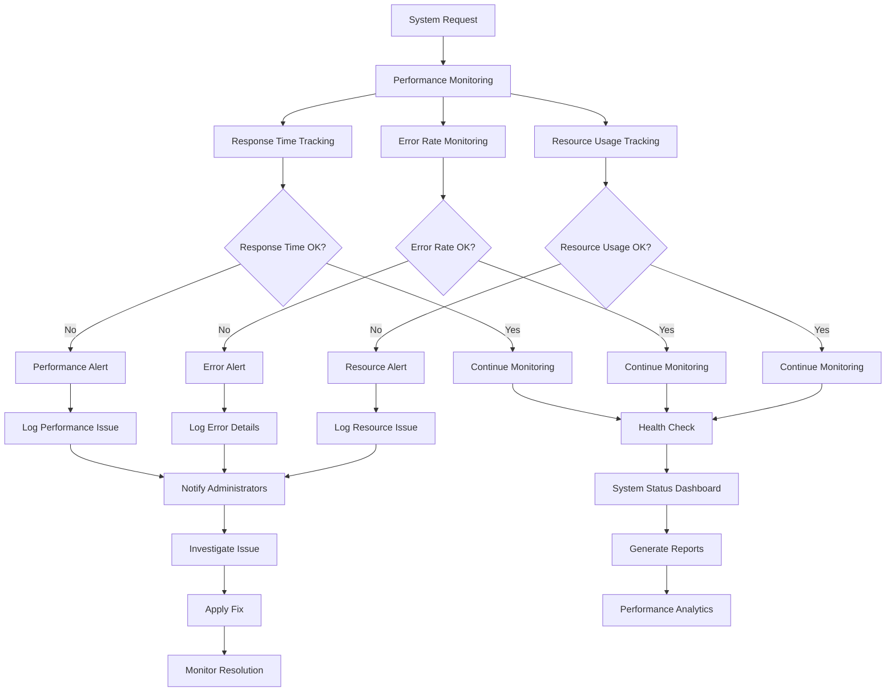

# HRM System - Workflow Diagrams & Process Flow

## 📋 Table of Contents
- [User Authentication Flow](#user-authentication-flow)
- [Employee Attendance Workflow](#employee-attendance-workflow)
- [Leave Management Workflow](#leave-management-workflow)
- [HR Employee Management Workflow](#hr-employee-management-workflow)
- [Notification System Flow](#notification-system-flow)
- [Data Access Control Flow](#data-access-control-flow)
- [System Integration Flow](#system-integration-flow)

---

## 🔐 User Authentication Flow

### Authentication Process Details:
1. **Route Protection**: All protected routes check for valid JWT
2. **Role Verification**: Each route validates user permissions
3. **Token Refresh**: Automatic token refresh before expiration
4. **Session Management**: Secure session handling with HTTP-only cookies

---

## ⏰ Employee Attendance Workflow

### Attendance Rules:
- **Grace Period**: 15 minutes after shift start
- **Auto Clock-Out**: 30 minutes after shift end
- **Break Tracking**: Unlimited breaks with time tracking
- **Overtime Calculation**: Hours beyond 8 hours/day
- **Weekend Detection**: Automatic weekend marking

---

## 🏖️ Leave Management Workflow

### Leave Types & Rules:
- **Casual Leave**: 12 days/year, can be taken in advance
- **Sick Leave**: 6 days/year, medical certificate required for >2 days
- **Paid Leave**: 18 days/year, advance approval required

---

## 👥 HR Employee Management Workflow

### HR Capabilities:
- **Full Employee Access**: View/edit all employee data
- **Attendance Management**: Approve corrections, mark absent/holiday
- **Leave Management**: Approve/reject leave requests
- **Reporting**: Generate various HR reports
- **Bulk Operations**: Mass updates and imports

---

## 🔔 Notification System Flow

### Notification Channels:
- **Real-Time**: Server-Sent Events (SSE)
- **Email**: Multi-provider email system
- **In-App**: Notification bell with unread count
- **Database**: Persistent notification storage

---

## 🛡️ Data Access Control Flow

### Access Control Matrix:
| Role | Own Data | Team Data | All Employee Data | System Admin |
|------|----------|-----------|-------------------|--------------|
| Employee | ✅ | ❌ | ❌ | ❌ |
| Manager | ✅ | ✅ | ❌ | ❌ |
| HR | ✅ | ✅ | ✅ | ❌ |
| HR_Manager | ✅ | ✅ | ✅ | Limited |
| SuperAdmin | ✅ | ✅ | ✅ | ✅ |

---

## 🔄 System Integration Flow

### Integration Points:
- **Calendarific**: Automatic holiday data synchronization
- **Email Services**: Multi-provider email delivery
- **File Storage**: Secure document and image storage
- **Background Jobs**: Automated system maintenance
- **Real-time Updates**: Live data synchronization
- **Audit System**: Comprehensive activity logging

---

## 📊 Performance & Monitoring Flow

### Monitoring Metrics:
- **Response Time**: API endpoint performance
- **Error Rates**: System error tracking
- **Resource Usage**: CPU, memory, database performance
- **User Activity**: Login patterns, feature usage
- **System Health**: Service availability and status

---

This workflow documentation provides visual representations of the key processes in the HRM system, helping developers and stakeholders understand how different components interact and how data flows through the system.